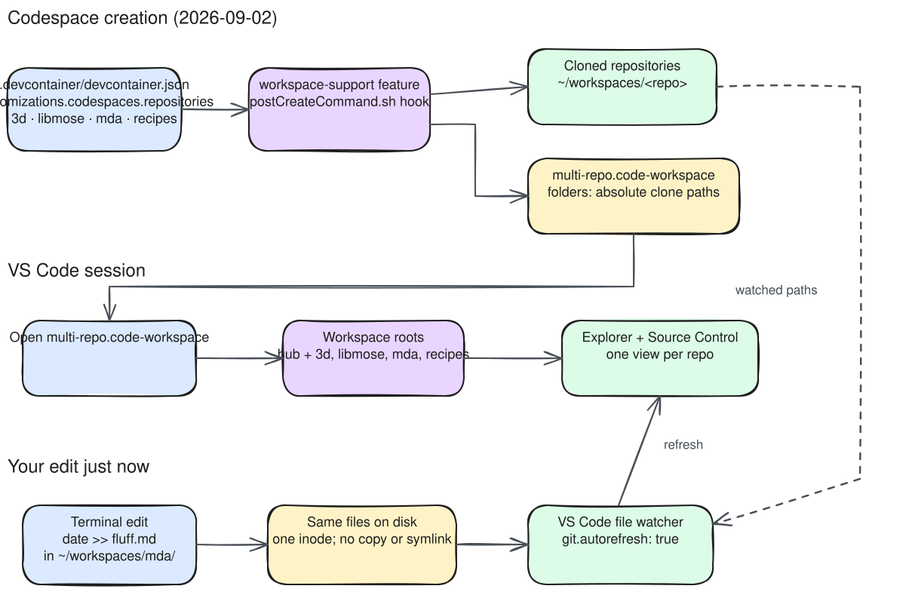

# mrwc — workspace wiring diagram

How the four satellite repositories end up in your VS Code nav pane, and why an
edit in the terminal shows up there instantly.

## Diagram

[](excal-diag.svg)

The SVG above is a **static image** — it renders in any browser with no
JavaScript, extensions, or Codespace required. Click it to open the raw SVG
full-size.

## How it works (summary)

1. **Codespace creation** — `.devcontainer/devcontainer.json` lists the four
   repos under `customizations.codespaces.repositories`. The
   `workspace-support` feature's post-create hook clones each into
   `~/workspaces/<repo>` and regenerates `multi-repo.code-workspace` with
   matching absolute paths.
2. **VS Code session** — opening that workspace file mounts five roots (the hub
   plus the four clones), which is what populates the Explorer nav pane and the
   per-repo SCM views.
3. **Live edits** — the terminal and the editor point at the *same files* on
   disk. VS Code's file watcher (plus `git.autorefresh: true`) is why
   `date >> fluff.md` appeared in the nav pane immediately.

## Source files

| File | Role |
|------|------|
| [excal-diag.excalidraw](excal-diag.excalidraw) | Editable source (open in VS Code with the Excalidraw extension, or at excalidraw.com) |
| [excal-diag.svg](excal-diag.svg) | Rendered image — auto-regenerated by the [Update Excalidraw SVGs](../../.github/workflows/excalidraw.yaml) workflow on every push that touches `*.excalidraw` |

## Regenerating the SVG

You don't need to — the workflow does it automatically. But to do it locally:

```bash
npm install --global excalidraw-brute-export-cli
npx playwright install --with-deps firefox
excalidraw-brute-export-cli \
  --input excal-diag.excalidraw \
  --output excal-diag.svg \
  --format svg --scale 1
```
