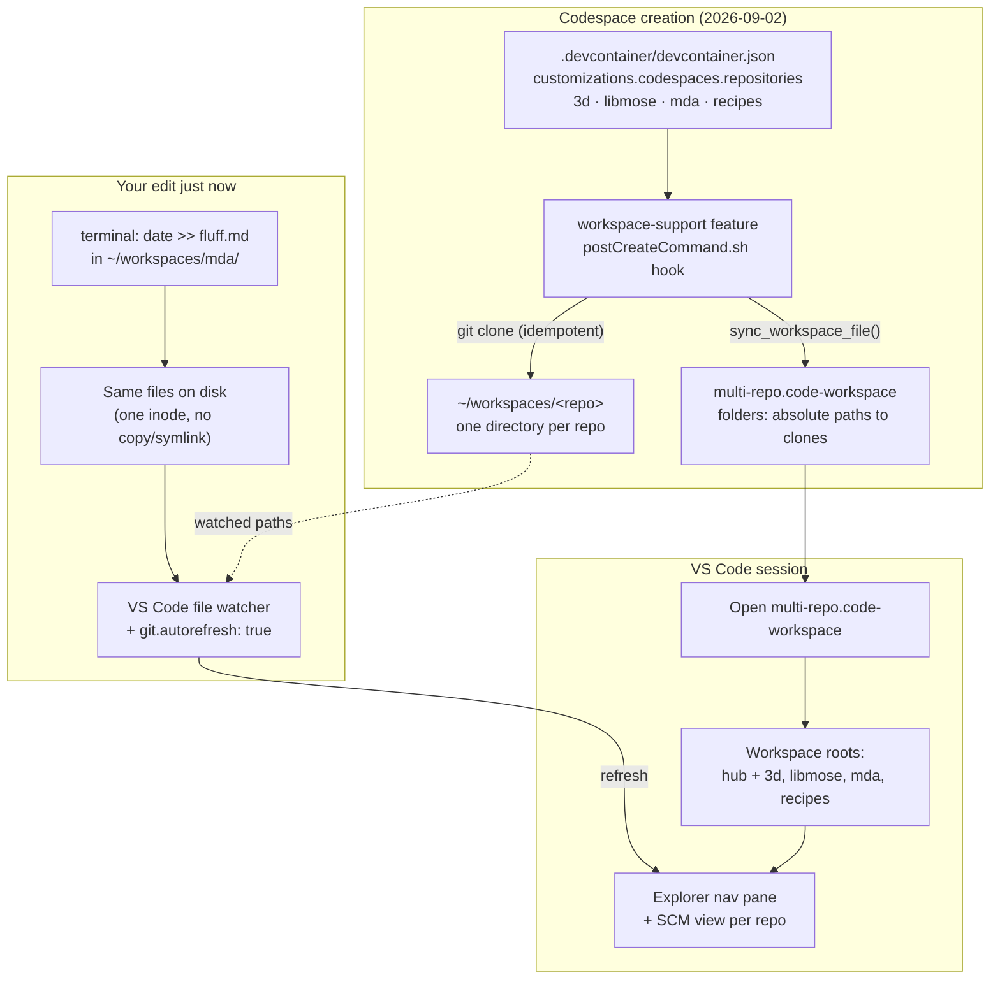

```mermaid
flowchart TD
    subgraph container["Codespace creation (2026-09-02)"]
        dc[".devcontainer/devcontainer.json<br/>customizations.codespaces.repositories<br/>3d · libmose · mda · recipes"]
        feat["workspace-support feature<br/>postCreateCommand.sh hook"]
        dc --> feat
        feat -->|"git clone (idempotent)"| clones["~/workspaces/&lt;repo&gt;<br/>one directory per repo"]
        feat -->|"sync_workspace_file()"| wsf["multi-repo.code-workspace<br/>folders: absolute paths to clones"]
    end

    subgraph vscode["VS Code session"]
        open["Open multi-repo.code-workspace"]
        roots["Workspace roots:<br/>hub + 3d, libmose, mda, recipes"]
        nav["Explorer nav pane<br/>+ SCM view per repo"]
        open --> roots --> nav
    end

    wsf --> open

    subgraph edit["Your edit just now"]
        term["terminal: date &gt;&gt; fluff.md<br/>in ~/workspaces/mda/"]
        same["Same files on disk<br/>(one inode, no copy/symlink)"]
        watch["VS Code file watcher<br/>+ git.autorefresh: true"]
        term --> same --> watch
    end

    clones -.->|"watched paths"| watch
    watch -->|"refresh"| nav
```
