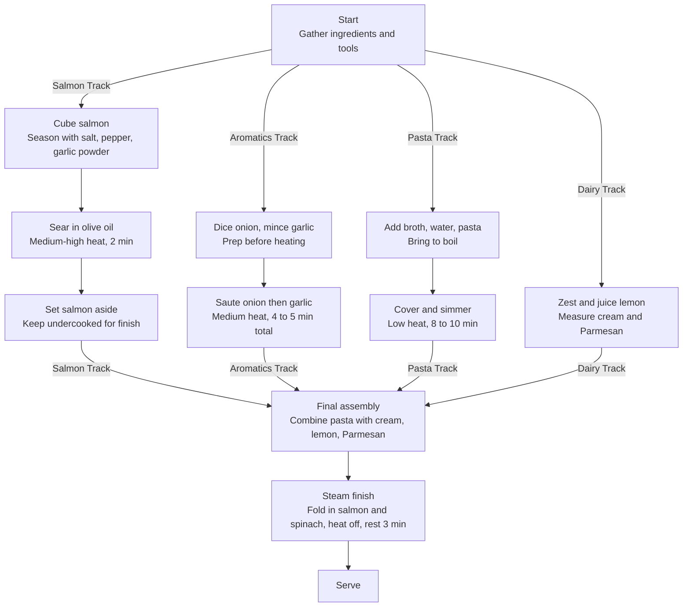

# Creamy Lemon Salmon Pasta Flowchart

[🖨 Printable version](https://michaeldallen.github.io/mdabone/recipes/creamy-lemon-salmon/flowchart.html)

```mermaid
flowchart TD
    A["Start\nGather ingredients and tools"]

    A -- "Salmon Track" --> B["Cube salmon\nSeason with salt, pepper, garlic powder"]
    B --> C["Sear in olive oil\nMedium-high heat, 2 min"]
    C --> D["Set salmon aside\nKeep undercooked for finish"]

    A -- "Aromatics Track" --> E["Dice onion, mince garlic\nPrep before heating"]
    E --> F["Saute onion then garlic\nMedium heat, 4 to 5 min total"]

    A -- "Pasta Track" --> G["Add broth, water, pasta\nBring to boil"]
    G --> H["Cover and simmer\nLow heat, 8 to 10 min"]

    A -- "Dairy Track" --> I["Zest and juice lemon\nMeasure cream and Parmesan"]

    D -- "Salmon Track" --> J["Final assembly\nCombine pasta with cream, lemon, Parmesan"]
    F -- "Aromatics Track" --> J
    H -- "Pasta Track" --> J
    I -- "Dairy Track" --> J

    J --> K["Steam finish\nFold in salmon and spinach, heat off, rest 3 min"]
    K --> L["Serve"]
```
