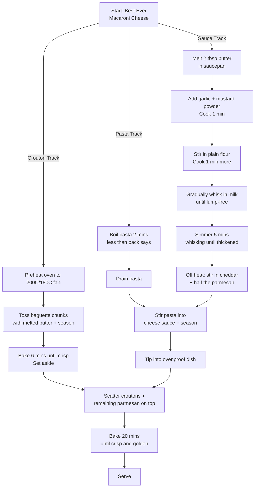

# Mac and Cheese Recipe Flowchart

[🖨 Printable version](https://michaeldallen.github.io/mdabone/recipes/mac-and-cheese/flowchart.html)

```mermaid
flowchart TD
    A[Start: Best Ever\nMacaroni Cheese]

    A -- "Crouton Track" --> B[Preheat oven to 200C/180C fan]
    B --> C[Toss baguette chunks\nwith melted butter + season]
    C --> D[Bake 6 mins until crisp\nSet aside]

    A -- "Pasta Track" --> E[Boil pasta 2 mins\nless than pack says]
    E --> F[Drain pasta]

    A -- "Sauce Track" --> G[Melt 2 tbsp butter\nin saucepan]
    G --> H[Add garlic + mustard powder\nCook 1 min]
    H --> I[Stir in plain flour\nCook 1 min more]
    I --> J[Gradually whisk in milk\nuntil lump-free]
    J --> K[Simmer 5 mins\nwhisking until thickened]
    K --> L[Off heat: stir in cheddar\n+ half the parmesan]

    F --> M[Stir pasta into\ncheese sauce + season]
    L --> M

    M --> N[Tip into ovenproof dish]
    D --> O[Scatter croutons +\nremaining parmesan on top]
    N --> O

    O --> P[Bake 20 mins\nuntil crisp and golden]
    P --> Q[Serve]
```
