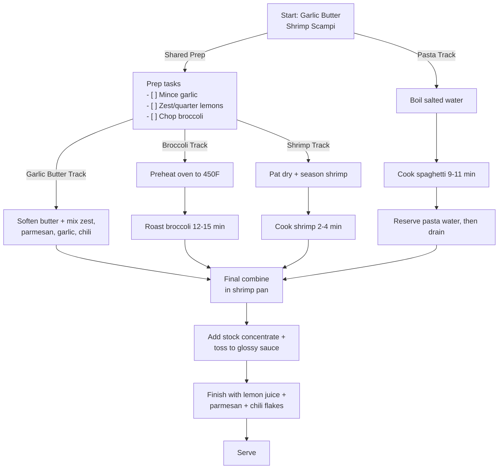

# Scampi Recipe Dependency Flowchart

```mermaid
flowchart TD
    A[Start: Garlic Butter\nShrimp Scampi] -- "Shared Prep" --> B["<div align='left'>Prep tasks<br/>- [ ] Mince garlic<br/>- [ ] Zest/quarter lemons<br/>- [ ] Chop broccoli</div>"]

    B -- "Broccoli Track" --> C[Preheat oven to 450F]
    C --> D[Roast broccoli 12-15 min]

    B -- "Garlic Butter Track" --> E[Soften butter + mix zest,\nparmesan, garlic, chili]

    B -- "Shrimp Track" --> F[Pat dry + season shrimp]
    F --> G[Cook shrimp 2-4 min]

    A -- "Pasta Track" --> H[Boil salted water]
    H --> I[Cook spaghetti 9-11 min]
    I --> J[Reserve pasta water, then drain]

    E --> K[Final combine\nin shrimp pan]
    D --> K
    G --> K
    J --> K

    K --> L[Add stock concentrate +\ntoss to glossy sauce]
    L --> M[Finish with lemon juice +\nparmesan + chili flakes]
    M --> N[Serve]
```
